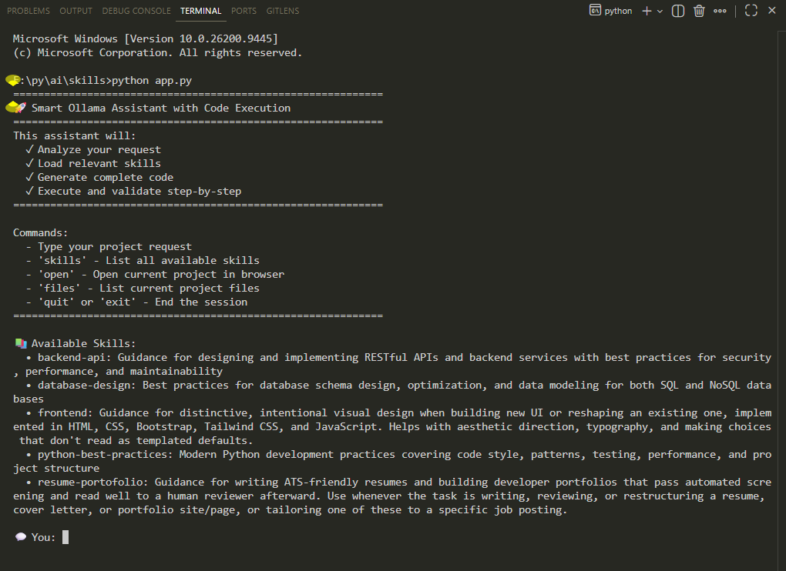

# Smart Ollama Assistant

An intelligent local code-generation assistant that analyzes your prompt, loads relevant skills, generates complete multi-file projects using a local Ollama model, and validates the output.

## Features

- 🧠 **Skill routing**: A first Ollama call determines which skills are relevant to your request
- 📚 **Dynamic skill loading**: Loads expertise from `.md` skill files — flat files and directory-based skills with examples
- 🤖 **Smart project naming**: Ollama generates a clean, filesystem-safe folder name per project
- 📁 **Complete project output**: Creates all code files automatically under `output/`
- ✅ **Code validation**: Validates HTML structure, CSS braces, and JavaScript bracket balance
- 🌐 **Browser preview**: Opens `index.html` directly from the REPL

## Prerequisites

1. **Ollama** running locally with the **qwen2.5-coder:7b** model:
   ```bash
   ollama list
   # If not available:
   ollama pull qwen2.5-coder:7b
   ```

2. **Python 3.10+** with the **requests** library:
   ```bash
   pip install requests
   ```

## Quick Start: CLI Snap

```bash
python app.py
```



## How It Works

Each request makes three sequential Ollama calls:

1. **Skill routing** — the model reads skill descriptions and returns which ones apply
2. **Code generation** — the selected skills (including any examples) are injected into the prompt; the model returns fenced code blocks
3. **Project naming** — the model returns a lowercase hyphenated folder name

The response is then parsed for fenced code blocks, files are written to `output/<project-name>/`, and validators run on each file.

## REPL Commands

| Command | Action |
|---------|--------|
| Any prompt | Run the full generation pipeline |
| `skills` | List all available skills and descriptions |
| `open` | Open `index.html` of the current project in the browser |
| `files` | List all files in the current project directory |
| `quit` / `exit` | End the session |

## Example Session

```
💬 You: create an ATS-friendly resume for a fullstack developer

🔍 Analyzing request...
🧠 Selected skills: resume-portofolio

🤖 Generating code...

📝 Writing files...
Created: index.html
Created: styles.css

� Validating generated files...

📄 index.html
  ✅ Validation passed

📄 styles.css
  ✅ Validation passed

✅ Project created: ats_friendly_resume_fullstack

💬 You: open
🌐 Opened index.html in browser
```

## Available Skills

### Flat skills (`skills/*.md`)

| Skill ID | Loaded for |
|---|---|
| `frontend` | UI, landing pages, portfolios, dashboards — distinctive visual design using HTML, CSS, Bootstrap, Tailwind, JS |
| `backend-api` | REST APIs, endpoints, authentication, error handling, security |
| `database-design` | SQL/NoSQL schemas, normalization, indexes, migrations |
| `python-best-practices` | Python scripts, type hints, testing, project structure, performance |

### Directory-based skill (`skills/<name>/skill.md` + `examples/`)

| Skill ID | Loaded for |
|---|---|
| `resume-portofolio` | ATS-friendly resumes, cover letters, developer portfolios, job-posting tailoring |

Directory-based skills include numbered example files from `examples/` that are injected verbatim into the generation prompt, providing few-shot guidance to the model.

## Adding a New Skill

**Flat skill** — create a single `.md` file in `skills/`:

```
skills/
└── my-skill.md
```

```markdown
---
name: my-skill
description: One-line description the router uses to decide relevance
---

# My Skill

Instructions the model should follow...
```

**Directory-based skill with examples** — create a subdirectory:

```
skills/
└── my-skill/
    ├── skill.md        ← required, same frontmatter format
    └── examples/
        ├── 01-example.md
        └── 02-example.md
```

## Project Structure

```
skills/
├── app.py                   # Entry point — wires everything together
├── chat.py                  # Prototype: simple multi-turn chat (no file output)
├── plan.py                  # Prototype: skill-routing chat (no file output)
├── assistant/
│   ├── ollama_client.py     # HTTP transport to Ollama API
│   ├── skill_manager.py     # Loads and looks up skills from disk
│   ├── prompt_router.py     # Selects relevant skills per request
│   ├── code_generator.py    # Orchestrates the full generation pipeline
│   ├── code_parser.py       # Extracts fenced code blocks from Ollama response
│   └── project_manager.py   # Manages output/ directory and browser preview
├── validators/
│   ├── html_validator.py    # Checks DOCTYPE and required tags
│   ├── css_validator.py     # Checks non-empty and balanced braces
│   └── javascript_validator.py  # Checks balanced brackets/parens/braces
├── skills/                  # Skill library
│   ├── frontend.md
│   ├── backend-api.md
│   ├── database-design.md
│   ├── python-best-practices.md
│   └── resume-portofolio/
│       ├── skill.md
│       └── examples/
└── output/                  # Generated projects (created on first run)
```

## Generated File Types

| Language block | Output file |
|---|---|
| ` ```html ` | `index.html` |
| ` ```css ` | `styles.css` |
| ` ```javascript` / ` ```js` | `scripts.js` |
| ` ```python ` | `main.py`, `script2.py`, … |
| ` ```sql ` | `schema.sql` |
| ` ```json ` | `package.json` or `config.json` |

Blocks with unrecognised language identifiers are skipped silently.

## Configuration

All defaults live in the class constructors and can be changed at instantiation in `app.py`.

**Change model:**
```python
ollama_client = OllamaClient(model="qwen2.5-coder:3b")
```

**Change Ollama URL:**
```python
ollama_client = OllamaClient(base_url="http://your-server:11434")
```

**Change output directory:**
```python
project_manager = ProjectManager(output_dir="my_projects")
```

**Change skills directory:**
```python
skill_manager = SkillManager(skills_dir="my_skills")
```

## Validation

Validators are heuristic checks — they catch obvious structural problems but do not replace a real linter.

| File | Checks |
|---|---|
| `.html` | `<!DOCTYPE html>` present, `<html>`, `<head>`, `<body>`, `</html>` present |
| `.css` | Non-empty, `{` and `}` counts match |
| `.js` | `{}`、`()`、`[]` counts all balanced |
| `.sql`, `.py`, other | No validator — reported as info, not an error |

## Troubleshooting

**"Error communicating with Ollama"**
Confirm Ollama is running: `ollama list`

**"No supported code blocks were found"**
The model returned plain prose instead of fenced code blocks. Try a more specific prompt, e.g. *"generate a complete SQL schema for an ecommerce database"*.

**Skill not selected**
Type `skills` to see the exact skill IDs. The router matches on display names and IDs — if the model returns an unexpected string the fallback substring match should still resolve it.

**Browser won't open**
Open the file manually: `output/<project-name>/index.html`

## Example Prompts

```
Create an ATS-friendly resume for a finance manager
Build a landing page for a coffee shop with dark mode
Generate a complete SQL schema for an ecommerce database
Create a REST API design document for a user management service
Make a fullstack developer portfolio with project cards
Build a Python CLI tool for batch file renaming
```

## Performance

| Step | Approximate time |
|---|---|
| Skill routing (Ollama call 1) | 1–3 s |
| Code generation (Ollama call 2) | 10–30 s |
| Project naming (Ollama call 3) | 1–2 s |
| File writing + validation | < 1 s |
| **Total** | **~15–35 s** |

## Requirements

- Python 3.10+
- `requests` (`pip install requests`)
- Ollama with `qwen2.5-coder:7b`

## License

See LICENSE.txt for complete terms.
